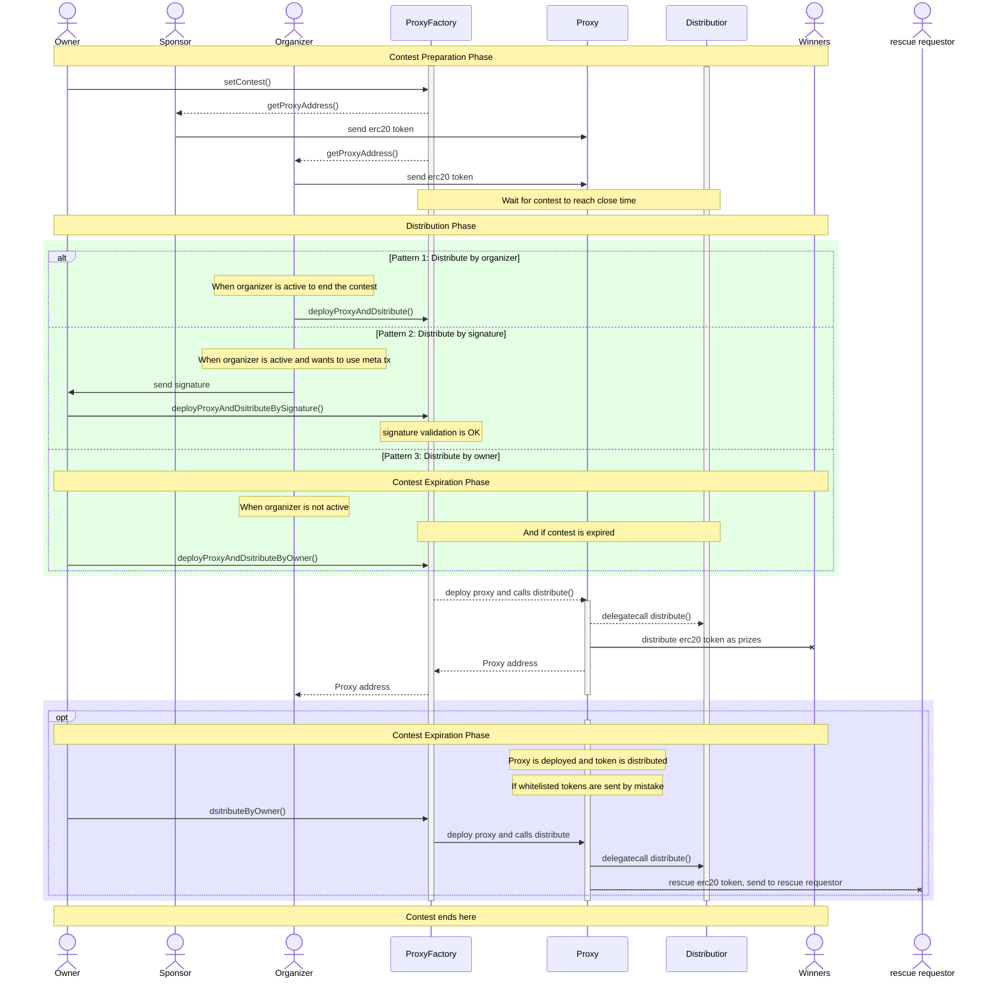

# Incentive

Nowadays information is spread around the world in an incredible speed. However, in some isolated area the information gap is too substantial to conquer the problems. One of the biggest problems we noticed is neither there are talented people nor incentives to create great ideas in some of the ares.

We found that there are many problems can be solved by the community in a more innovative and open way if things are done openly and smartly with adequate incentives.

We think if more problem can solved, then more value can be created. And if more value can be created, then more people can get the benefites.

Because of this, we have created SPARKN.

# What is SPARKN

SPARKN protocol is a Web3 project that aims to build a marketplace for anyone who wants to solve their problems or anyone who wants to help solve the problems.
As a first step, we have created the protocol in the first place. The details of how to use the protocol is up to the users.

## Scope

-   src/
    -   ProxyFactory.sol
    -   Distributor.sol
    -   Proxy.sol

## Out of Scope

Any file except for the files in above Scope.

## Contracts

The contracts in this repository are used as escrow of SPARKN users' assets on chain.
Our goal is to make sure assets on SPARKN are safe and transparent no matter who is using it.

These contracts are responsible for the escrow of users' funds and distributing them to the winners of the contests.
We tried to keep things simple and safe.

All the contracts are sitting in the `src/` folder. These are the core contracts of the protocol.

The contracts are supposed to be deployed to any EVM compatible chains.

# Roles

There are mainly 3 roles in the protocol. Another role is the owner.

-   Organizer: The person who creates the contest and is responsible for distributing the prizes to the winners. We also sometimes call it innovator.
-   Sponsor: the person who is willing to fund the contest. Sponsor can be the same person as the organizer or anyone else.
-   Supporter: the person who is willing to help solve the problem. Winners are selected from supporters.
-   Owner: The administrator of the protocol.
    The graph below is the structure of the contracts in the protocol.


### More Context

-   The contracts is created with the philosophy of "supporter first".  
    If a contest is created and funded there is no way to refund. All the funds belongs to the persons who wants to help solve the problem, we call them "supporters".
-   SPARKN protocol consists of both web3 and web3, and the system can be changed in the future. Because the structure of the contracts are very simple and straightforward, and at the same time, all contests have their own life cycle. After the contests' life cycle endds, it is easy to upgrade the system in the future when we decided to do it with new contests since then.

#### `ProxyFactory.sol`

This the main entry point of the protocol.
It has several functions.

-   Owner can use it to set new contests.
-   Organizer can use it to deploy proxy and distribute prizes to winners.
-   Organizer can use meta transaction to send signature to someone else to deploy proxy and distribute prizes to winners.
-   Owner can deploy proxy and distribute prizes to winners if organizer did not call the function in time to distribute prizes to winners.
-   Owner can distribute the token stuck in the proxy after its depployment.
-   Anyone can call `getProxyAddress()` to get the address of the proxy.
-   It has a whitelist inside.

#### `Distributor.sol`

This is a contract used as logic contract of the proxy. It will not be used as a single contract, but it will be called through proxy as delegate calls.  
It has function as follows.

-   Only proxy factory can call `distribute` function to distribute prizes to winners.
-   During the distribution of prizes, a certain portion of the token in the proxy contract will be sent to the stadium address as fee.
-   During the calls, it will check the whitelist in factory contract.

#### `Proxy.sol`

This is a proxy contract. It will be deployed by the factory contract. This contract is paired with every single contest in the protocol.

-   It is designed with minimal logic in it.
-   All the calls to proxy contract will be delegated to the implementation(distributor) contract.

## Tests

Tests are in the `test/` folder. More explanations about test cases can be found in the test folder's [`README.md`](https://github.com/codefox-inc/sparkn-contracts/tree/main/test) file.

## Known Issues

These are known issues or designed by purpose.

-   There is a way to rescue the token stuck in the proxy contract after the deployment and distribution of prizes only when the token is whitelisted. If the token is not whitelisted, and then if someone sent the token by mistake, the token will be stuck there forever.
-   Proxy contracts are supposed to be disposed after the contest is over. If there is a need to upgrade the protocol, we will just create a new implementation contract and deploy proxies with the new implementation contract. And so is the factory contract.
-   Owner is in charge of some of the key functions of the protocol. Owner's centralization risk is not an issue at this moment.
-   We may build a reputation system in the futue to handle the issue of the system being maliciously used, e.g., sybil attack.

## Notes

-   We have designed the protocol by using a lot of immutable variables. So it is supposed that there is no state variable collision in the system. If you find any issue, please report it.

## Sequence Diagram of the Protocol

This sequence diagram shows how the protocol works considering the process of the contest with the actors in the protocol.



# How to Start

1. Install dependencies

```bash
forge install
```

2. Run tests

```bash
forge test
```

run a single test file

```bash
forge test --mt <test_function_name>
```

run fuzz test

```bash
forge test -vvv --match-contract FuzzTestProxyFactory
```

see test coverage

```bash
forge coverage
```

3. Deploy contracts

```bash
forge deploy --network <network>
```

or deploy to local network

```bash
make deploy
```

4. Other things to do

Format the codes

```bash
make format
```

# Reference

-   [Foundry Book](https://book.getfoundry.sh/)
-   [OpenZeppelin](https://docs.openzeppelin.com/contracts/4.x/)
